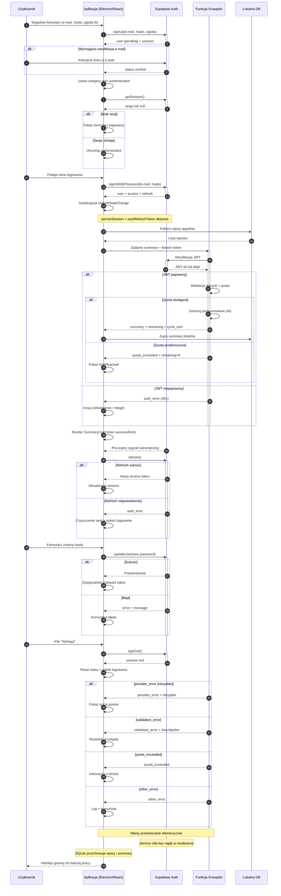

```mermaid
sequenceDiagram
autonumber

participant User as Użytkownik
participant Electron as Aplikacja (Electron/React)
participant Supabase as Supabase Auth
participant EdgeFn as Funkcja Krawędzi
participant SQLite as Lokalna DB

%% --- Rejestracja ---
User->>Electron: Wypełnia formularz (e‑mail, hasło, zgoda AI)
Electron->>Supabase: signUp(e‑mail, hasło, zgoda)
activate Supabase
Supabase-->>Electron: user (pending) + session
deactivate Supabase
alt Wymagana weryfikacja e‑mail
  User->>Supabase: Kliknięcie linku w e‑mail
  Supabase-->>Electron: status verified
end
Electron->>Electron: Ustaw wstępny stan authenticated

%% --- Autologin przy starcie aplikacji ---
Electron->>Supabase: getSession()
activate Supabase
Supabase-->>Electron: sesja lub null
deactivate Supabase
alt Brak sesji
  Electron->>Electron: Pokaż formularz logowania
else Sesja istnieje
  Electron->>Electron: Utrzymaj authenticated
end

%% --- Logowanie ---
User->>Electron: Podaje dane logowania
Electron->>Supabase: signInWithPassword(e‑mail, hasło)
activate Supabase
Supabase-->>Electron: user + access + refresh
deactivate Supabase
Electron->>Electron: Subskrypcja onAuthStateChange

Note over Electron,Supabase: persistSession + autoRefreshToken aktywne

%% --- Generowanie podsumowania (chronione) ---
Electron->>SQLite: Pobierz wpisy tygodnia
SQLite-->>Electron: Lista wpisów
Electron->>EdgeFn: Żądanie summary + Bearer token
activate EdgeFn
EdgeFn->>Supabase: Weryfikacja JWT
activate Supabase
Supabase-->>EdgeFn: JWT ok lub błąd
deactivate Supabase
alt JWT poprawny
  EdgeFn->>EdgeFn: Walidacja danych + quota
  alt Quota dostępna
    EdgeFn->>EdgeFn: Generuj podsumowanie (AI)
    EdgeFn-->>Electron: summary + remaining + cycle_end
    Electron->>SQLite: Zapis summary lokalnie
  else Quota przekroczona
    EdgeFn-->>Electron: quota_exceeded + remaining=0
    Electron->>Electron: Pokaż limitReached
  end
else JWT niepoprawny
  EdgeFn-->>Electron: auth_error (401)
  Electron->>Electron: Inicjuj odświeżenie / relogin
end
deactivate EdgeFn

%% --- Wyświetlenie karty podsumowania ---
Electron->>Electron: Render SummaryCard (stan success/limit)

%% --- Odświeżanie tokenu (automatyczne) ---
Supabase-->>Electron: Pre‑expiry sygnał (wewnętrzny)
Electron->>Supabase: refresh()
activate Supabase
alt Refresh sukces
  Supabase-->>Electron: Nowy access token
  Electron->>Electron: Aktualizacja session
else Refresh niepowodzenie
  Supabase-->>Electron: auth_error
  Electron->>Electron: Czyszczenie sesji + pokaż logowanie
end
deactivate Supabase

%% --- Zmiana hasła ---
User->>Electron: Formularz zmiany hasła
Electron->>Supabase: updateUser(new password)
activate Supabase
alt Sukces
  Supabase-->>Electron: Potwierdzenie
  Electron->>Electron: (Opcjonalnie) Odśwież token
else Błąd
  Supabase-->>Electron: error + message
  Electron->>Electron: Komunikat błędu
end
deactivate Supabase

%% --- Wylogowanie ---
User->>Electron: Klik "Wyloguj"
Electron->>Supabase: signOut()
activate Supabase
Supabase-->>Electron: session null
deactivate Supabase
Electron->>Electron: Reset stanu + widok logowania

%% --- Błędy funkcji krawędzi ---
alt provider_error (retryable)
  EdgeFn-->>Electron: provider_error + retryable
  Electron->>Electron: Pokaż opcję ponów
else validation_error
  EdgeFn-->>Electron: validation_error + lista błędów
  Electron->>Electron: Wyświetl szczegóły
else quota_exceeded
  EdgeFn-->>Electron: quota_exceeded
  Electron->>Electron: Informacja o limicie
else other_error
  EdgeFn-->>Electron: other_error
  Electron->>Electron: Log + komunikat
end

Note over EdgeFn,Electron: Wpisy przetwarzane efemerycznie
Note over Supabase: Service role key nigdy w rendererze
Note over Electron: SQLite przechowuje wpisy i summary

Electron-->>User: Interfejs gotowy do dalszej pracy
```
