<architecture_analysis>
1. Komponenty (istniejące + planowane związane z autentykacją i przepływem podsumowań):
   - Layout / Strony: Main (layout), SidebarNav (implicit w Main), AppRoutes, HistoryPageView, SettingsView, ProfileView.
   - Onboarding: OnboardingModal.
   - Capture: CapturePopup (popup dodawania wpisów), EntryForm (z poziomu historii), openCaptureWindow (akcja).
   - Historia: HistoryView, HistoryHeader, WeekGroup, DayGroup, EntryRow, DuplicateGroup, PaginationControl, DeleteConfirmationModal, ToastArea.
   - Podsumowania: SummaryCard, CurrentWeekSummarySection (plan / integracja), useSummaryOperations (logika), EdgeFunctionClient (warstwa komunikacji).
   - Autentykacja (planowane / spec): AuthModal (kontener + state machine), AuthModalHeader, AuthFormLogin, AuthFormRegister, AuthEmailVerificationNotice, AuthFormPasswordResetRequest, AuthFormPasswordSetNew, AuthFormPasswordChange, AuthFooter, AuthErrorBanner, FormField, ProtectedFeatureGate.
   - Kontekst / stan: useSupabase (hook sesji), (plan) AuthStore (session, user, isEmailVerified, metody login/register/refresh/logout/password flows), SecureTokenProvider (plan), History state hooks (useHistoryState), useEntries, useCapture.
   - Repo/persistencja lokalna: SQLite repositories (entriesRepository, summariesRepository, settingsRepository) – pośrednio używane przez History i Summaries.
   - Inne UI bazowe: Button, Input, Textarea, Card, Alert, Dialog itd. (biblioteka UI).

2. Główne strony i ich komponenty:
   - /history: HistoryPageView -> HistoryView -> (HistoryHeader, WeekGroup*, PaginationControl, DeleteConfirmationModal, ToastArea). W WeekGroup zawarty SummaryCard (wymaga gatingu autentykacji).
   - /settings: SettingsView (placeholder – brak zależności od auth w MVP).
   - /profile: ProfileView (placeholder – w przyszłości może korzystać z AuthStore).
   - Layout globalny: Main -> SidebarNav -> AppRoutes wyświetla powyższe widoki. OnboardingModal może pojawić się przy pierwszym uruchomieniu na /history.
   - Modalne powierzchnie niezależne od routingu: AuthModal (otwierany kontekstowo przez ProtectedFeatureGate lub akcje użytkownika), CapturePopup, DeleteConfirmationModal.

3. Przepływ danych (high-level):
   - Użytkownik interakcja -> (ProtectedFeatureGate lub przycisk w SummaryCard) -> AuthModal (akcja login/register) -> Supabase (signIn/signUp) -> onAuthStateChange -> useSupabase aktualizuje (session, user) -> AuthStore (plan) propaguje -> SummaryCard aktualizuje summaryState z 'unauthorized' do 'pending' (jeśli wpisy istnieją i email zweryfikowany) lub do stanu 'pending weryfikacji' (reprezentowane UI przez AuthEmailVerificationNotice / gating).
   - Generowanie podsumowania: SummaryCard (akcja "Generate") -> EdgeFunctionClient.generateWeeklySummary (Bearer access_token) -> Supabase Edge Function -> weryfikacja JWT -> generacja/limit -> wynik (summary lub quota_exceeded) -> aktualizacja lokalnej bazy + odświeżenie WeekGroup -> SummaryCard stan: 'success' / 'limitReached' / 'failed'.
   - Reset hasła / zmiana hasła: AuthModal stany password_reset_request → (email link) → password_set_new → updateUser → sesja odświeżona → gating odblokowany.
   - Email verification: po rejestracji -> AuthEmailVerificationNotice (stan email_verification_pending) → użytkownik klika "Sprawdź ponownie" → refreshUser() -> jeśli verified => zamknięcie modalu i odblokowanie premium (SummaryCard przechodzi z 'unauthorized' do 'pending').
   - Wylogowanie: AuthModal (akcja) lub kontrolka w przyszłym profilu -> signOut -> useSupabase czyści session -> SummaryCard zmienia na 'unauthorized'.

4. Opis funkcjonalny kluczowych komponentów:
   - Main: globalny layout z nawigacją.
   - AppRoutes: definicje tras.
   - HistoryPageView: integruje OnboardingModal i HistoryView.
   - HistoryView: orkiestruje stan historii, ładuje tygodnie, renderuje WeekGroup.
   - WeekGroup: prezentuje jeden ISO tydzień (DayGroup + SummaryCard).
   - DayGroup / EntryRow / DuplicateGroup: reprezentacja wpisów dziennych + grupowanie powtórzeń.
   - SummaryCard: UI stanu podsumowania tygodniowego (pending/generating/success/failed/unauthorized/limitReached) + edycja treści.
   - ProtectedFeatureGate: pokazuje CTA logowania / weryfikacji gdy zasób premium zablokowany.
   - AuthModal: kontener dla stanów auth; centralna state machine.
   - AuthFormLogin / Register / Password* / VerificationNotice / Change: formularze w modularnych stanach AuthModal.
   - AuthErrorBanner: wyświetlanie błędów operacji auth.
   - useSupabase: hook zarządzania sesją (session, user).
   - AuthStore (plan): spójna warstwa domenowa nad useSupabase + logika emailVerified / gating.
   - EdgeFunctionClient: klient do wywołań generate_weekly_summary (walidacja, retry, quota).
   - OnboardingModal: wprowadzenie UX pierwszego uruchomienia.
   - CapturePopup: szybkie dodawanie wpisów.
   - ToastArea / DeleteConfirmationModal / PaginationControl: pomocnicze elementy UX.
   - UI bazowe (Button, Input, etc.): zestaw stylizowanych prymitywów.

5. Aktualizacje wynikające z nowych wymagań autentykacji:
   - NOWE: AuthModal + wszystkie AuthForm* + AuthEmailVerificationNotice + ProtectedFeatureGate + AuthErrorBanner + AuthFormPassword*.
   - ZMODYFIKOWANE: SummaryCard (dodane stany unauthorized / limitReached), WeekGroup (propagacja nowych stanów summary), HistoryView (pośrednie – integracja gatingu), EdgeFunctionClient (status.authenticated flag), useSupabase (źródło sesji dla gatingu).

6. Moduły stanu:
   - AuthStore (plan) / useSupabase – źródło praw do generowania.
   - History / Summaries hooks – źródło danych historycznych + integracja wyników funkcji edge.
   - EdgeFunctionClient internal status (quota, lastError) – udostępniany SummaryCard.

7. Granice i przepływy:
   - UI Auth oddzielony: brak lokalnej kopii usera w SQLite; tylko pamięć + localStorage Supabase.
   - Funkcje premium blokowane do: (a) zalogowania, (b) weryfikacji email, (c) dostępnego limitu.

8. Skróty ID wykorzystywane w diagramie:
   - Prefix "P" = Page/Layout, "F" = Feature, "A" = Auth, "S" = Summary, "H" = History, "C" = Capture, "Ctx" = context/store, "EF" = Edge Function client.

```mermaid
flowchart TD

%% === GŁÓWNA STRUKTURA LAYOUT / ROUTES ===
subgraph "Warstwa Layout & Routing"
  P_Main["Main Layout"]
  P_Routes["AppRoutes"]
  P_Main --> P_Routes

  subgraph "Strony"
    P_History["HistoryPageView"]
    P_Settings["SettingsView"]
    P_Profile["ProfileView"]
  end

  P_Routes --> P_History
  P_Routes --> P_Settings
  P_Routes --> P_Profile
end

%% === ONBOARDING ===
subgraph "Onboarding"
  O_Onboarding["OnboardingModal"]
end
P_History --> O_Onboarding:::conditional

%% === CAPTURE FEATURE ===
subgraph "Feature Capture"
  C_Popup["CapturePopup"]
  C_Shortcut["Globalny Skrót"]
  C_Form["EntryForm (inline)"]
end

C_Shortcut --> C_Popup
P_History --> C_Popup
P_History --> C_Form

%% === HISTORIA (WYŚWIETLANIE) ===
subgraph "Feature Historia"
  H_View["HistoryView"]
  H_Header["HistoryHeader"]
  H_Week["WeekGroup"]
  H_Day["DayGroup"]
  H_Row["EntryRow / DuplicateGroup"]
  H_Pagination["PaginationControl"]
  H_Delete["DeleteConfirmationModal"]
  H_Toast["ToastArea"]
end

P_History --> H_View
H_View --> H_Header
H_View --> H_Week
H_View --> H_Pagination
H_View --> H_Delete
H_View --> H_Toast
H_Week --> H_Day
H_Day --> H_Row

%% === PODSUMOWANIA (SUMMARY) ===
subgraph "Feature Podsumowania"
  S_Card["SummaryCard"]
  S_Gate["ProtectedFeatureGate"]
end

H_Week --> S_Card
S_Card -->|Stan unauthorized/limit| S_Gate

%% === AUTENTYKACJA (STATE MACHINE) ===
subgraph "Moduł Autentykacji (State Machine)"
  direction TB
  A_Modal["AuthModal"]
  A_Login["AuthFormLogin"]
  A_Register["AuthFormRegister"]
  A_Verify["AuthEmailVerificationNotice"]
  A_ResetReq["AuthFormPasswordResetRequest"]
  A_SetNew["AuthFormPasswordSetNew"]
  A_Change["AuthFormPasswordChange"]
  A_Error["AuthErrorBanner"]
  A_Footer["AuthFooter"]

  A_Modal --> A_Login
  A_Modal --> A_Register
  A_Modal --> A_Verify
  A_Modal --> A_ResetReq
  A_Modal --> A_SetNew
  A_Modal --> A_Change
  A_Modal --> A_Error
  A_Modal --> A_Footer
end

S_Gate -->|Akcja Logowanie/Rejestracja| A_Modal
A_Login -->|signIn success + verified| S_Card
A_Login -->|email niezweryfikowany| A_Verify
A_Register -->|signUp pending| A_Verify
A_Verify -->|Refresh check| A_Modal
A_ResetReq -->|resetPasswordForEmail| A_Login
A_SetNew -->|updateUser new password| A_Modal
A_Change -->|updateUser change| A_Modal

%% === KONTEKST / STAN / API ===
subgraph "Stan & API"
  Ctx_Auth["useSupabase (session,user)"]
  Ctx_Store["AuthStore (planowany)"]
  EF_Client["EdgeFunctionClient"]
  DB_Local["SQLite Entries & Summaries"]
end

C_Popup -->|Dodaje wpis| DB_Local
C_Form -->|Dodaje wpis| DB_Local
H_View -->|Ładowanie tygodni| DB_Local
S_Card -->|Zapis/edycja summary| DB_Local

Ctx_Auth --> Ctx_Store
Ctx_Store --> S_Card
Ctx_Store --> S_Gate
Ctx_Auth --> S_Gate
Ctx_Auth --> A_Modal

S_Card -->|Generate| EF_Client
EF_Client -->|Bearer access_token| SupabaseAuth[(Supabase Auth / EdgeFn)]
SupabaseAuth -->|JWT weryfikacja| EF_Client
EF_Client -->|summary / quota| S_Card

%% === FLOW GATING LOGIC ===
S_Gate -->|Brak sesji| A_Login
S_Gate -->|Brak weryfikacji| A_Verify
S_Gate -->|Limit wyczerpany| S_Card

%% === STANY SUMMARY ===
S_Card -->|pending to generating| S_Card
S_Card -->|generating to success| S_Card
S_Card -->|generating to failed| S_Card
S_Card -->|unauthorized logout| S_Gate
S_Card -->|limitReached| S_Gate

%% === WYLOGOWANIE ===
A_Modal -->|logout| Ctx_Auth
Ctx_Auth -->|session null| S_Card

%% === POWIĄZANIA LAYOUTU Z CECHAMI ===
P_History --> H_View
P_History --> S_Card
P_History --> S_Gate

%% === STYLE / KLASY ===
classDef updated fill:#ffe7c2,stroke:#cc8400,stroke-width:1px,color:#2b1900;
classDef new fill:#c2f5ff,stroke:#007d99,stroke-width:1px,color:#002b33;
classDef store fill:#e0e0ff,stroke:#4d4ddb,stroke-width:1px,color:#1b1b4d;
classDef external fill:#fdd,stroke:#d33,stroke-width:1px,color:#300;
classDef conditional fill:#f4f4f4,stroke:#999,stroke-dasharray:3 3,color:#222;

%% Oznaczenia nowych komponentów
class A_Modal,A_Login,A_Register,A_Verify,A_ResetReq,A_SetNew,A_Change,A_Error,A_Footer,S_Gate new;
%% Oznaczenia zaktualizowanych komponentów
class S_Card,H_Week,H_View updated;
%% Konteksty / store
class Ctx_Auth store;
class Ctx_Store store;
class EF_Client store;
class DB_Local store;
%% Zewnętrzne
class SupabaseAuth external;
%% Condition / modal transitional
class O_Onboarding conditional;
```

</architecture_analysis>

<mermaid_diagram>

</mermaid_diagram>

Legend:
- Kolor niebieski (new): nowe komponenty wprowadzone przez wymagania autentykacji.
- Kolor pomarańczowy (updated): komponenty zmodyfikowane (dodane stany, integracja gatingu).
- Store/API: warstwy stanu i integracji.
- External: zewnętrzna usługa (Supabase).
- Przerywane (conditional): modal / stan warunkowy.

Opis skrótowy przepływu generowania podsumowania:
1. Użytkownik na /history widzi SummaryCard (stan unauthorized jeśli brak sesji).
2. Klik CTA → ProtectedFeatureGate → AuthModal (login/register).
3. Po login + email verified → SummaryCard przechodzi do pending (jeśli są wpisy).
4. Klik Generate → EdgeFunctionClient → Supabase Edge Function.
5. Sukces → zapis summary w SQLite → S_Card success (edycja możliwa).
6. Limit lub błąd → stany limitReached / failed (retry).
7. Wylogowanie → useSupabase czyści session → S_Card -> unauthorized.

Plik generowany automatycznie – aktualizuj wraz z dodaniem realnych komponentów auth w kodzie.