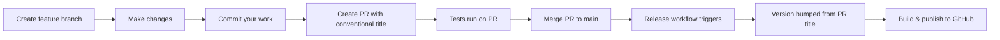

# Quick Release Guide

## TL;DR

1. Create a PR with a conventional commit title (e.g., `feat: add dark mode`)
2. Merge PR to `main` → automatic release happens
3. Done! ✨

**Important:** The PR title determines the version bump, so make sure it follows the conventional commit format!

## Conventional Commits Quick Reference

Use these formats for your **PR titles** (or commit messages if squash merging):

```bash
# Bug fixes (patch version bump: 1.0.0 → 1.0.1)
fix: resolve memory leak in capture window
fix(database): handle corrupted entries gracefully

# New features (minor version bump: 1.0.0 → 1.1.0)
feat: add dark mode support
feat(ui): implement new settings panel

# Breaking changes (major version bump: 1.0.0 → 2.0.0)
feat!: migrate to new database schema
fix!: remove support for legacy file format

# Or use BREAKING CHANGE in PR description:
feat: migrate to new database schema

BREAKING CHANGE: Old database format is no longer supported

# Other changes (patch version bump)
chore: update dependencies
docs: update README
refactor: simplify window management code
test: add coverage for capture feature
```

## Common Scopes

Use scopes to provide additional context:

- `feat(ui):` - UI/UX changes
- `feat(database):` - Database-related features
- `fix(capture):` - Capture window fixes
- `fix(sync):` - Sync functionality fixes
- `chore(deps):` - Dependency updates

## Workflow



**Key Point:** The workflow reads your **PR title** to determine the version bump, so:
- ✅ PR title: `feat: add export feature` → Minor bump
- ✅ PR title: `fix: resolve crash` → Patch bump
- ✅ PR title: `feat!: breaking change` → Major bump

## What Happens on Merge to Main?

1. ✅ Validation runs (typecheck + lint)
2. ✅ Tests run
3. 🔢 Version bumped based on commit message
4. 🏷️ Git tag created (e.g., `v1.2.3`)
5. 📦 App built for macOS (Intel + ARM64)
6. 🚀 GitHub Release published with artifacts

## Best Practices for PR Titles

1. **Always use conventional commit format for PR titles**
2. **Use scopes for clarity:** `feat(ui):`, `fix(database):`, etc.
3. **Squash and merge** is recommended for clean history
4. **Edit the PR title before merging** if needed

## Manual Version Bump (if needed)

```bash
npm run version:patch  # 1.0.0 → 1.0.1
npm run version:minor  # 1.0.0 → 1.1.0
npm run version:major  # 1.0.0 → 2.0.0
```

## Troubleshooting

### "Why didn't my version bump?"

Check your commit message format. It should start with:
- `feat:` for features
- `fix:` for bug fixes
- Add `!` for breaking changes (e.g., `feat!:`)

### "Release failed during build"

1. Check GitHub Actions logs
2. Ensure tests pass locally: `npm run validate && npm test`
3. Try building locally: `npm run make`

### "I merged multiple commits, which one counts?"

The workflow uses the **PR title** to determine the version bump. If you squash and merge, you can edit the final commit message to match the PR title.

## Pro Tips

1. **Set PR title in conventional format when creating the PR** - It determines the version
2. **Squash and merge PRs** - Keeps history clean and predictable
3. **Use meaningful PR titles** - They become your version history
4. **Update CHANGELOG.md** - Add entries under `[Unreleased]` section
5. **Test locally first** - Run `npm run validate` before pushing

## Example PR Workflow

```bash
# 1. Create feature branch
git checkout -b add-export-feature

# 2. Make changes and commit (can use any message)
git add .
git commit -m "WIP: working on export"

# 3. Push and create PR with conventional title
git push origin add-export-feature
# On GitHub: Create PR with title "feat: add export to PDF functionality"

# 4. After PR approval, merge it (the PR title is what matters!)
# PR title: "feat: add export to PDF functionality"

# 5. Automatic release creates v1.1.0 🎉
```

## Links

- [Conventional Commits](https://www.conventionalcommits.org/)
- [Semantic Versioning](https://semver.org/)
- [Full Release Workflow Documentation](./release-workflow.md)