# Mermaid Diagram - Auth Architecture

<authentication_analysis>
1. Przepływy autentykacji (wg PRD + istniejącej specyfikacji):
   - Rejestracja (signUp: e‑mail + hasło + zgoda na AI)
   - (Opcjonalnie) Weryfikacja e‑mail przez link
   - Autologin przy starcie aplikacji (pobranie istniejącej sesji)
   - Logowanie (signInWithPassword)
   - Subskrypcja zmian stanu (onAuthStateChange) dla utrzymania sesji
   - Generowanie chronionego zasobu (podsumowanie tygodnia via Edge Function)
   - Sprawdzenie limitu / quota (5 podsumowań w cyklu 28 dni)
   - Ochrona innych zasobów (dostęp warunkowy do funkcji premium)
   - Odświeżanie access tokenu (autoRefreshToken)
   - Zmiana hasła (updateUser(password))
   - Wylogowanie (signOut)
   - Obsługa błędów: quota_exceeded, provider_error (retryable),
     validation_error, auth_error
   - Brak trwałego zapisu treści wpisów w funkcji krawędziowej

2. Główni aktorzy i interakcje:
   - Użytkownik: inicjuje akcje (rejestracja, logowanie, generowanie podsumowań).
   - Aplikacja (React/Electron - renderer): wywołuje Supabase Auth
     (anon key), zarządza sesją i UI, formuje żądania do Edge Function.
   - Supabase Auth: zarządza kontem, sesją, tokenami (access/refresh).
   - Funkcja Krawędzi (EdgeFn) Supabase: generuje podsumowanie z danymi
     tygodnia; weryfikuje JWT, liczy quota, nie zapisuje treści wpisów.
   - Lokalna DB (SQLite): przechowuje wpisy i gotowe podsumowania lokalnie.

3. Procesy weryfikacji i odświeżania tokenów:
   - Przy każdej akcji chronionej Aplikacja dołącza Bearer access token.
   - EdgeFn weryfikuje JWT u Supabase.
   - autoRefreshToken: biblioteka Supabase JS sama odświeża token przed wygaśnięciem.
   - Na błędne odświeżenie: sesja czyszczona, UI przechodzi do stanu
     niezalogowanego.

4. Opis kroków autentykacji (skrót):
   - Rejestracja: Aplikacja->Supabase signUp; zwrot user+session; oczekiwanie
     na weryfikację e‑mail jeśli wymagane.
   - Start aplikacji: getSession(); jeśli brak — pokaż logowanie.
   - Logowanie: signInWithPassword; otrzymanie access & refresh; subskrypcja
     onAuthStateChange aktualizuje stan.
   - Generowanie podsumowania: Aplikacja zbiera wpisy tygodnia (SQLite),
     wysyła do EdgeFn z Bearer access; EdgeFn weryfikuje JWT; przetwarza; zwraca
     summary + quota; zapis lokalny.
   - Quota: jeśli brak pozostałych limitów — zwrot quota_exceeded zamiast summary.
   - Odświeżanie: automatyczne; w razie niepowodzenia czyszczenie sesji.
   - Zmiana hasła: updateUser; sukces lub błąd; przy sukcesie token może być
     odświeżony.
   - Wylogowanie: signOut; usunięcie sesji; UI reset.
   - Błędy: walidacja (validation_error), provider_error (retryable),
     quota_exceeded (blokada), auth_error (token nieważny).

```mermaid
sequenceDiagram
autonumber

participant User as Użytkownik
participant Electron as Aplikacja (React/Electron)
participant Supabase as Supabase Auth
participant EdgeFn as Funkcja Krawędzi
participant SQLite as Lokalna DB

%% --- Rejestracja ---
User->>Electron: Wpisuje e‑mail + hasło + zgoda AI
Electron->>Supabase: signUp(e‑mail, hasło, zgoda)
activate Supabase
Supabase-->>Electron: user (pending) + session
deactivate Supabase
alt Wymagana weryfikacja e‑mail
  User->>Supabase: Kliknięcie linku w e‑mail
  Supabase-->>Electron: status verified
end
Electron->>Electron: Ustaw authenticated (tymczasowo)

%% --- Autologin przy starcie aplikacji ---
Electron->>Supabase: getSession()
activate Supabase
Supabase-->>Electron: sesja lub null
deactivate Supabase
alt Brak sesji
  Electron->>Electron: Pokaż formularz logowania
else Sesja istnieje
  Electron->>Electron: Utrzymaj stan authenticated
end

%% --- Logowanie ---
User->>Electron: Podaje dane logowania
Electron->>Supabase: signInWithPassword(e‑mail, hasło)
activate Supabase
Supabase-->>Electron: user + access + refresh
deactivate Supabase
Electron->>Electron: Subskrypcja onAuthStateChange

Note over Electron,Supabase: persistSession + autoRefreshToken aktywne

%% --- Generowanie podsumowania (zasób chroniony) ---
Electron->>SQLite: Pobierz wpisy bieżącego tygodnia
SQLite-->>Electron: Lista wpisów
Electron->>EdgeFn: Żądanie summary + Bearer access
activate EdgeFn
EdgeFn->>Supabase: Weryfikacja JWT
activate Supabase
Supabase-->>EdgeFn: JWT ok lub błąd
deactivate Supabase
alt JWT poprawny
  EdgeFn->>EdgeFn: Walidacja formatu i quota
  alt Quota dostępna
    EdgeFn->>EdgeFn: Generuj podsumowanie (model AI)
    EdgeFn-->>Electron: summary + remaining + cycle_end
    Electron->>SQLite: Zapisz summary lokalnie
  else Quota przekroczona
    EdgeFn-->>Electron: quota_exceeded + remaining=0
    Electron->>Electron: Pokaż info o limicie
  end
else JWT niepoprawny
  EdgeFn-->>Electron: auth_error (401)
  Electron->>Electron: Inicjuj odświeżenie sesji
end
deactivate EdgeFn

%% --- Wyświetlenie podsumowania ---
Electron->>Electron: Render SummaryCard (stan success/limit)

%% --- Odświeżanie tokenu (automatyczne) ---
Supabase-->>Electron: Pre‑expiry event (internal)
Electron->>Supabase: refresh()
activate Supabase
alt Refresh sukces
  Supabase-->>Electron: Nowy access token
  Electron->>Electron: Aktualizuj session state
else Refresh niepowodzenie
  Supabase-->>Electron: auth_error
  Electron->>Electron: Czyszczenie sesji + wymuś logowanie
end
deactivate Supabase

%% --- Zmiana hasła ---
User->>Electron: Formularz zmiany hasła
Electron->>Supabase: updateUser(new password)
activate Supabase
alt Sukces
  Supabase-->>Electron: Potwierdzenie
  Electron->>Electron: (Opcjonalnie) Odśwież token
else Błąd
  Supabase-->>Electron: error + message
  Electron->>Electron: Komunikat błędu w UI
end
deactivate Supabase

%% --- Wylogowanie ---
User->>Electron: Kliknij "Wyloguj"
Electron->>Supabase: signOut()
activate Supabase
Supabase-->>Electron: session null
deactivate Supabase
Electron->>Electron: Reset stanu + widok logowania

%% --- Błędy funkcji krawędzi ---
alt Błąd dostawcy AI (provider_error)
  EdgeFn-->>Electron: Komunikat + retryable
  Electron->>Electron: Pokaż opcję ponów
else Błąd walidacji
  EdgeFn-->>Electron: validation_error + lista błędów
  Electron->>Electron: Wyświetl szczegóły
else Inny błąd
  EdgeFn-->>Electron: other_error
  Electron->>Electron: Log + informacja
end

Note over EdgeFn,Electron: Treść wpisów przetwarzana efemerycznie
Note over Supabase: Service role key nigdy w rendererze
Note over Electron: Lokalna DB przechowuje wpisy i summary

Electron->>User: Interfejs gotowy do dalszej pracy
```

</authentication_analysis>

<mermaid_diagram>

</mermaid_diagram>
